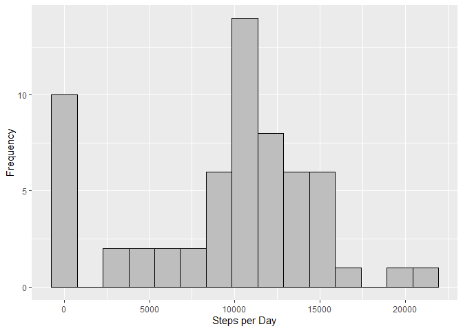
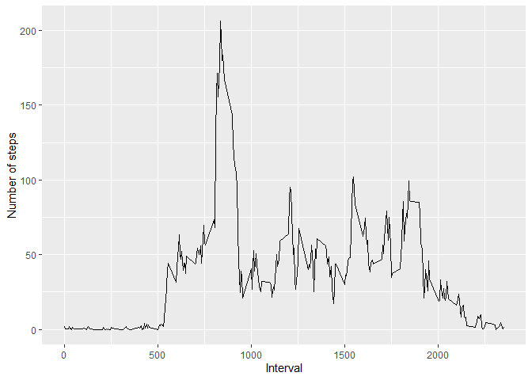
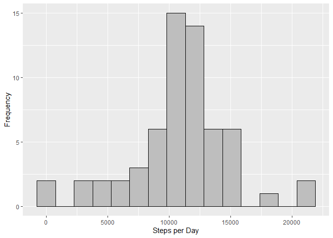
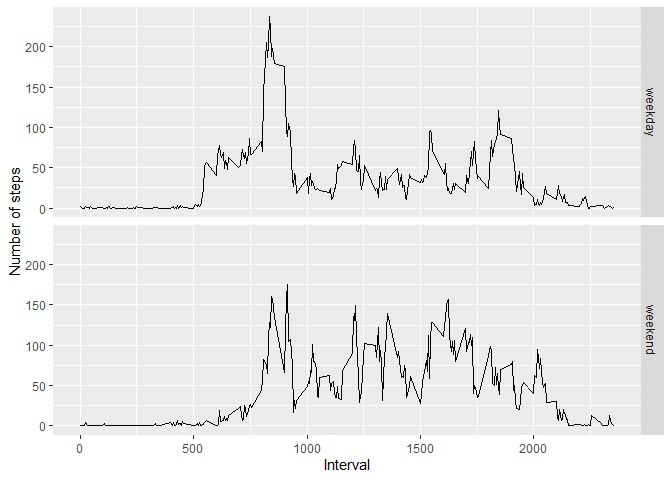

## Loading and preprocessing the data
Since the data *activity.csv* is compressed inside *activity.zip*, we have to unzip it using the R function **unz** then read the data file normally.


```r
df <- read.csv(unz("activity.zip", "activity.csv"))
str(df)
```

```
## 'data.frame':	17568 obs. of  3 variables:
##  $ steps   : int  NA NA NA NA NA NA NA NA NA NA ...
##  $ date    : chr  "2012-10-01" "2012-10-01" "2012-10-01" "2012-10-01" ...
##  $ interval: int  0 5 10 15 20 25 30 35 40 45 ...
```

As we can see above, the date column is read as a string, so before moving on let's convert it into a date object.


```r
df$date <- as.Date(df$date)
class(df$date)
```

```
## [1] "Date"
```

Much better!

## What is mean total number of steps taken per day?
In this part of the assignment we'll ignore missing values.

1. Now we'll calculate the number of steps taken per day using the R function **tapply** by grouping the rows per date.

```r
sums <- with(df, tapply(steps, date, sum, na.rm = TRUE))
sums[1:5]
```

```
## 2012-10-01 2012-10-02 2012-10-03 2012-10-04 2012-10-05 
##          0        126      11352      12116      13294
```

2. Let's plot the histogram of the number of steps per day.

```r
library(ggplot2)
qplot(sums, bins = 15, col = I("black"), fill = I("gray"), xlab = "Steps per Day", ylab = "Frequency")
```



We can see that there were a lot of days were the subject walked 10K-12K steps. Also, notice that there are a high number of zeros, a lot of this is because the data was missing (NA).

3. Finally, let's get the mean and median of the total number of steps per day.  

As we saw in the **sums** array above, days were no data was recorded were regarded as 0. This will skew the results, but for now we will ignore it.

```r
totStepsMean <- mean(sums)
totStepsMedian <- median(sums)
```
The mean of the total steps per day is ``9354`` steps while the median is ``10395`` steps.


## What is the average daily activity pattern?
Let's now investigate the steps per interval, instead of per day.

```r
meanSteps <- with(df, tapply(steps, interval, mean, na.rm = TRUE))
intervals <- as.integer(dimnames(meanSteps)[[1]])
qplot(intervals, meanSteps, geom="line", xlab = "Interval", ylab = "Number of steps")
```



By using the already defined arrays **meanSteps** and **intervals** we can find the maximum number of steps and the interval that it happens in.

```r
maxSteps <- max(meanSteps)
maxInterval <- intervals[which.max(meanSteps)]
```

The maximum number of steps is ``206``, which, on average, happens in the ``835`` interval.


## Imputing missing values
As we saw earlier, the missing data introduced some bias. We'll now find it out it's effect by trying to most accurately impute the missing values.

1. Let's first find the number of missing values

```r
missingSteps <- is.na(df$steps)
sum(missingSteps)
```

```
## [1] 2304
```

2. The imputing method I used will look at the mean of the missing interval across the same week day (e.g. If interval-5 on Sunday is missing, it finds the mean of all interval-5 Sundays)

```r
library(dplyr)
df$day <- weekdays(df$date)
averages <- df %>%
    group_by(interval, day) %>%
    summarise(intervalMean=mean(steps, na.rm = TRUE))
```

3. Now we create the new dataset

```r
new_df <- df[, 1:3]
for(i in 1:nrow(df)) {
    if(is.na(df[i, 1])) {
        averageIndex <- which(averages$interval == df[i, 3] & averages$day == df[i, 4])
        new_df[i, 1] <- averages[averageIndex, "intervalMean"][[1]]
    }
}

head(new_df)
```

```
##      steps       date interval
## 1 1.428571 2012-10-01        0
## 2 0.000000 2012-10-01        5
## 3 0.000000 2012-10-01       10
## 4 0.000000 2012-10-01       15
## 5 0.000000 2012-10-01       20
## 6 5.000000 2012-10-01       25
```

4. Finally let's plot the new histogram and calculate the new mean and median

```r
new_sums <- with(new_df, tapply(steps, date, sum))
new_totStepsMean <- mean(new_sums)
new_totStepsMedian <- median(new_sums)
qplot(new_sums, bins = 15, col = I("black"), fill = I("gray"), xlab = "Steps per Day", ylab = "Frequency")
```


Looks like most of the zero values are now distributed to the rest of the histogram, especially in the 10K-12K region.

The new mean of the total steps per day is ``10821`` steps while the new median is ``11015`` steps. We can see that both averages have gone up since the NA values have gone from zero to a positive number.

## Are there differences in activity patterns between weekdays and weekends?
1. Let's create the new “weekday” and “weekend” factor

```r
new_df$day <- weekdays(new_df$date)
weekEnd <- new_df$day == "Saturday" | new_df$day == "Sunday"
new_df[weekEnd, "day"] <- "weekend"
new_df[!weekEnd, "day"] <- "weekday"
new_df$day <- as.factor(new_df$day)
```

2. Finally, we plot weekdays and weekends separately

```r
grouped_df <- new_df %>%
    group_by(interval, day) %>%
    summarise(meanSteps = mean(steps))
#meanSteps <- with(new_df, tapply(steps, interval, mean, na.rm = TRUE))
#intervals <- as.integer(dimnames(meanSteps)[[1]])
qplot(interval, meanSteps, data = grouped_df, geom="line", facets = day~., xlab = "Interval", ylab = "Number of steps")
```



Notice the differences in the spikes and their severity. It looks like on weekdays, the subject moves a lot around the 800-900 intervals but then stays mostly sedentary (perhaps going to work). However, on the weekends the subject's walks are shorter but more frequent.

